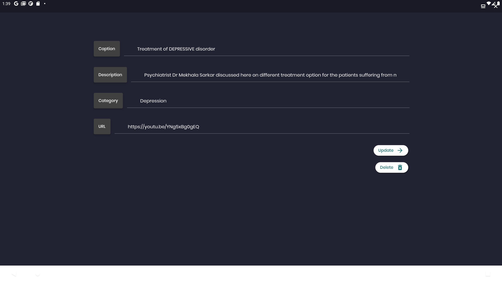

# Admin Panel

Admin Panel Complete Mental Health Solution

## Getting Started

---

**This is the admin panel of Complete Mental Health Solution**
Built for android, ios and MacOS
Version 1.0


## Features:

---

Admin can view the overview of various Metrics.

## How to use

---

As This is a Admin application, only admin user can view it.

To build the app on your device please **email me SHA 1 and SHA 256 Hashes of your keystore.**
once I add this to project repository, you can run it on your device otherwise you can't build it on your device.

None other than admin can access the app. **If you want to access it,
first try to sign with your google account, we will be notified that you are trying to access our admin panel.
 you can't get access unless you are manually unless we give you permission**
 please email us your mail @<abir1turza@gmailcom> and we will add your email as admin and you can sign in to the admin panel.

 <span style="color:red">We have disabled this feature for your testing only. So that you can use it.</span>

 ## Overview

---

 ### Login Screen

---


 ### Sign up With Google

---


 ### Dashboard

---


1. Overview Metrices
2. Detection Module Overview
3. Recent Session Overview
 
 ### Update Meeting view

---


 ### Creating Meeting View

---


 ### Article Module

---


 ### Aticles

---


 ### Add or Edit Articles

---


 ### Interactive Article Editor

---


 ### You an Also Edit Articles in HTML

---


 ### Video Module

---


 ### Videos List by categories

---


 ### Add or Update Video

---



 ### Transaction Module

---


 ### Create Transactions

---


 ### Interactive Date and time picker for transaction time

---


 ### Users Overview

---


 ### Add or edit user informations

---


 ### Doctor Overview

---


 ### Detection Module

---


 ### Add or Edit Detection Question

---


---
---


## Terms of Use


Version 1.0

The Complete Mental Health solution website is a copyrighted work belonging to the Bangladesh University of Engineering and Technology. Certain features of the Site may be subject to additional guidelines, terms, or rules, which will be posted on the Site in connection with such features.

1. Subject to these Terms. The company grants you a non-transferable, non-exclusive, revocable, limited license to access the Site solely for your own personal, noncommercial use.

2. Certain Restrictions. The rights approved to you in these Terms are subject to the following restrictions: 
```
    a) you shall not sell, rent, lease, transfer, assign, distribute, host, or otherwise commercially exploit the Site; 

    b) you shall not change, make derivative works of, disassemble, reverse compile, or reverse engineer any part of the Site; 

    c) you shall not access the Site to build a similar or competitive website; and 

    d) except as expressly stated herein, no part of the Site may be copied, reproduced, distributed, republished, downloaded, displayed, posted, or transmitted in any form or by any means.
```

3. Third-Party Links & Ads. The Site may contain links to third-party websites and services

4. Other Users. Each Site user is solely responsible for any of its own User Content. Because we do not control User Content, you acknowledge and agree that we are not responsible for any User Content, whether provided by you or by others.

Copyright Policy.

The company respects the intellectual property of others and asks that users of our Site do the same. In connection with our Site, we have adopted and implemented a policy respecting copyright law that provides for the removal of any infringing materials and for the termination of users of our online Site who are repeated infringers of intellectual property rights, including copyrights. If you believe that one of our users is, through the use of our Site, unlawfully infringing the copyright(s) in a work, and wish to have the allegedly infringing material removed, the following information in the form of a written notification (under 17 U.S.C. § 512(c)) must be provided to our designated Copyright Agent:

a)Your physical or electronic signature;

b) Identification of the copyrighted work(s) that you claim to have been infringed;

c) Identification of the material on our services that you claim is infringing and that you request us to remove;

d) Sufficient information to permit us to locate such material - your address, telephone number, and e-mail address;


